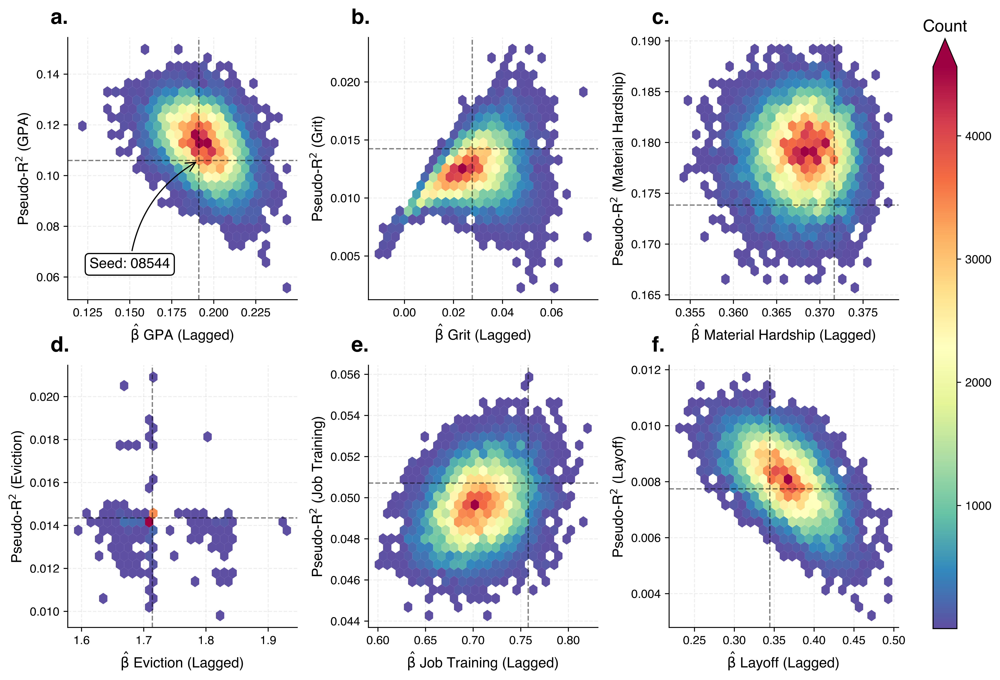

# On the Responsible use of Pseudo-Random Number Generators in Scientific Research

### Introduction
Are you conducting academic research with a computational tool that produces a different outcome each time? Great; you are probably familiar with the idea of setting a seed to instantiate the pseudo-random number generator causing this variance. Conventional wisdom in the academic literature and community forums generally advocates setting a **single** seed to consistently generate the same result regardless of who runs a script or where the code is run (assuming identical system dependencies).

In this work we argue the opposite. Computational reproducibility is vital, but it should not come at the expense of assuming that a single scalar estimand is invariant to the seed. Through a large number of simulations, teaching examples, and high-profile replications, we describe and showcase how to analyze and visualize seed variability for the scientific record.

### Quick start
- Python 3.11; install requirements with `pip install -r requirements.txt`.
- Most scripts run from `./src`. Example: `python src/build_llms.py` (requires an OpenAI API key at `./keys/openai_api_key.txt`).
- Seeds live in `./assets/seed_list.txt` and are generated via `int.from_bytes(secrets.token_bytes(4), 'big')` capped at 2147483647.
- Figures and tables are written to `./figures/` and `./tables/`; many scripts emit CSVs alongside.

### Repository map (selected)
- `src/`: main analyses (e.g., `build_llms.py`, `build_compound_grf.py`, `build_rw_seeds.py`, `build_schelling.py`, `build_mnist_seeds.py`, `build_needle_seeds.py`).
- `assets/`: seed lists and supporting art (`seed_list.txt`, `ffc_seeds.png`).
- `figures/`, `tables/`: outputs generated by scripts.
- `data/`: small bundled data plus placeholders for external downloads (see below).
- `paper_offline/`: manuscript materials.

### Code
`./src/` contains the computational (re-)analyses: Buffon's Needle, Bitcoin random walks, cross-validation sensitivity, Fragile Families Challenge, mvprobit in Stata, and more. A summarizing notebook for visualizations lives at `src/visualization_notebook.ipynb`. Requirements are listed in `requirements.txt`.

### Data
Most of the code comes self-contained; it generates simulated data, or pulls data down from internet archives. In two specific examples, it is necessary to download the data:

1. Data to replicate the results in the [Fragile Families Challenge](https://www.pnas.org/doi/10.1073/pnas.1915006117) comes from the "Replication materials for Measuring the predictability of life outcomes using a scientific mass collaboration" site on the Harvard Dataverse, available [here](https://dataverse.harvard.edu/dataset.xhtml?id=3743481).
2. Data from the Millenium Cohort Study which is necessary to replicate [the paper](https://scholar.google.co.uk/citations?view_op=view_citation&hl=en&user=QQBbWokAAAAJ&citation_for_view=QQBbWokAAAAJ:UeHWp8X0CEIC) comes from [here](https://cls.ucl.ac.uk/cls-studies/millennium-cohort-study) but requires a little pre-processing as per Dr. Orben's [GitHub repo](https://github.com/OrbenAmy/NHB_2019) related to that work.

### License
See `LICENSE` for terms. The datasets above have their own licensing conditions; respect those accordingly.

### Acknowledgements
We are grateful to the extensive comments made by various people in our course of thinking about this work, not least the members of the [Leverhulme Centre for Demographic Science](https://demography.ox.ac.uk/).

If you're having issues with anything failing to run, or have comments about where seeds are applicable in your own workstreams, please don't hesitate to raise an issue or otherwise get in contact!

#### Other areas where we seeds to be important but not included for analysis here:

1. Exponential Random Graph Models
2. Bayesian Factor Analysis (and other Bayesian frameworks more generally)
3. Some simple KNN type of thing.
